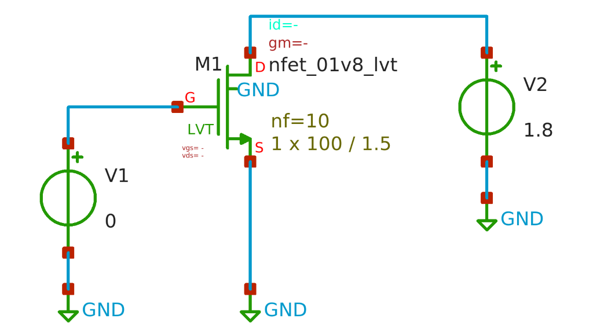

We will extract the small-signal characteristics of MOSFETs using open-source and free available PDKs and CAD tools. The analysis is carried out using the SkyWater **sky130** PDK, **Xschem** as the schematic capture tool, and **Ngspice** as the circuit simulator.

All tools (Xschem, Ngspice, and sky130 PDK) must be installed properly on a Linux system. In this overview, Ubuntu running under WSL is used. The installation procedure is discussed in a separate article.

The reader is assumed to have a basic understanding of MOSFET device physics and the fundamentals of MOSFET operation. @fig-mosfet illustrates the structure and symbols of NMOS and PMOS devices. In integrated-circuit design, each MOSFET has four terminals: gate (G), source (S), drain (D), and bulk (B). Modern CMOS technologies typically employ a p-type substrate; therefore, the bulk of all NMOS devices (except native devices) is tied to the substrate, i.e., GND or VSS. In contrast, PMOS devices are fabricated in isolated wells, allowing their bulks to be biased independently.

{#fig-mosfet}

# Operation regions:

A MOSFET behaves as a switch (ON or OFF) in digital design, but in analog design it operates in one of three regions:

-   Cut-off (off): $V_{GS} < V_{TH} \quad and \quad V_{GD} < 0$
-   Saturation: $V_{GS} > V_{TH} \quad and \quad V_{GD} < 0$
-   Triode (on): $V_{GS} > V_{TH} \quad and \quad V_{GD} > 0$

Note that the transition between these regions is smooth, especially near the threshold voltage.

# Voltage–Current Characteristics:

To explain MOSFET operation, we review the V–I equations of an NMOS transistor. PMOS equations follow the same form.

## Triode region (ON):

$$
I_D=\mu_nC_{ox}\frac{W}{L}\left[\left(V_{GS}-V_{TH}\right)V_{DS}-\frac{1}{2}V_{DS}^2\right]
$$ {#eq-DrainCurrent}

For $V_{DS} << 2(V_{GS} - V_{TH})$:

$$
I_D\approx\mu_nC_{ox}\frac{W}{L}\left(V_{GS}-V_{TH}\right)V_{DS}
$$ {#eq-IdTriode2}

## Saturation region:

Considering channel length modulation, the mosfet current is:

$$
I_D=\frac{1}{2}\mu_nC_{ox}\frac{W}{L}\left(V_{GS}-V_{TH}\right)^2(1+\lambda\ V_{DS})
$$ {#eq-IdSat}

The parameter λ is the channel-length modulation coefficient, which decreases with increasing channel length.

$$
\lambda\propto\frac{1}{L}
$$ {#eq-lambda}

# Second-order effects:

## Body effect:

Increasing the source-to-bulk voltage raises the threshold voltage:

$$
V_{TH}=V_{TH0}+\gamma\left(\sqrt{2\Phi_F+V_{SB}}-\sqrt{\left|2\Phi_F\right|}\right)
$$ {#eq-vth}

$$
\gamma=\frac{\sqrt{2q\epsilon_{si}N_{sub}}}{C_{ox}}\approx0.3\ to\ 0.4\ \left(V^\frac{1}{2}\right)
$$ {#eq-gamma}

$$
V_{TH0}=\Phi_{MS}+2\Phi_F+\frac{Q_{dep}}{C_{ox}}=V_{TH}\ when\ V_{SB}=0
$$ {#eq-vth0}

## Subthreshold (weak inversion):

When $V_{GS} \approx V_{TH}$, the device enters weak inversion, and the drain current follows:

$$
I_D=I_0\exp{\frac{V_{GS}}{\xi V_T}}
$$ {#eq-IdWeak}

where $I_0$ is proportional to $W/L$, $\xi > 1$, and $V_T=kT/q$. We say the device operates in 'weak inversion' in contrast with 'strong inversion'.

# Small-signal model:

@fig-mosmodel shows the small-signal model of NMOS @designo. The reader can extract the model of PMOS as well.

{#fig-mosmodel}

## Equations:

In triode region, a MOSFET behaves as a voltage-controlled resistor:

$$
R_{on}=\frac{1}{\mu_nC_{ox}\frac{W}{L}(V_{GS}-V_{TH})}
$$ {#eq-Ron}

In saturation, the transconductance is:

$$
g_m=\frac{\partial I_D}{\partial V_{GS}}
$$ {#eq-gm}

Equivalent expressions include:

$$
g_m=\mu_nC_{ox}\frac{W}{L}(V_{GS}-V_{TH})
$$ {#eq-gm2}

$$
g_m=\sqrt{2\mu_nC_{ox}\frac{W}{L}I_D}
$$ {#eq-gm3}

$$
g_m=\frac{2I_D}{V_{GS}-V_{TH}}
$$ {#eq-gm4}

The output resistance due to channel-length modulation is:

$$
r_o=\frac{1}{g_{ds}}=\frac{\partial V_{DS}}{\partial I_D}=\frac{1}{\frac{1}{2}\mu_nC_{ox}\frac{W}{L}\left(V_{GS}-V_{TH}\right)^2\times\lambda}
$$ {#eq-rout}

Given $\lambda V_{DS} << 1$, we have

$$
r_o=\frac{1}{g_{ds}}=\frac{1+\lambda V_{DS}}{\lambda I_D}\approx\frac{1}{\lambda I_D}
$$ {#eq-rout2}

The body-effect transconductance is:

$$
g_{mb}=\frac{\partial I_D}{\partial V_{BS}}=gm\frac{\gamma}{2\sqrt{2\Phi_F+V_{SB}}}=\eta\ g_m
$$ {#eq-gmb}

# Simulation results:

## Long-channel NMOS:

The circuit in @fig-sch_DC_sweep is used to evaluate the small-signal, low frequency behavior of an NMOS device. Because capacitances are not considered in this section, DC-sweep analysis is employed.

{#fig-sch_DC_sweep}

Here, the W/L is 100u/1.5u, number of gates (fingers) are 10, and the VGS sweep is from 0 to 1.8V. @fig-gmgds-vgs shows gm and gds of the NMOS versus VGS.



In this circuit, $V_{TH}$ ≈ 470mV. As expected, by increasing $V_{GS}$, both $g_m$ and $g_{ds}$ increase. It’s interesting to see the gds – Id relationship as shown in @fig-gds-id. The curve is nearly linear, and according to @eq-rout2, its slope is corresponds to the channel-length modulation coefficient $\lambda$.



The intrinsic small-signal gain of a MOSFET is defined as

$$
A_v = g_mr_o = \frac{g_m}{g_{ds}}
$$ {#eq-fetgain}

The intrinsic gain of an long-channel NMOS is shown in @fig-gm_gds-vgs. As can be seen, in saturation region, the gain peaks at around $V_{GS}=0.56V$ that means with overdrive voltage of abour 100mV the device reachs its maximum intrinsic gain.



